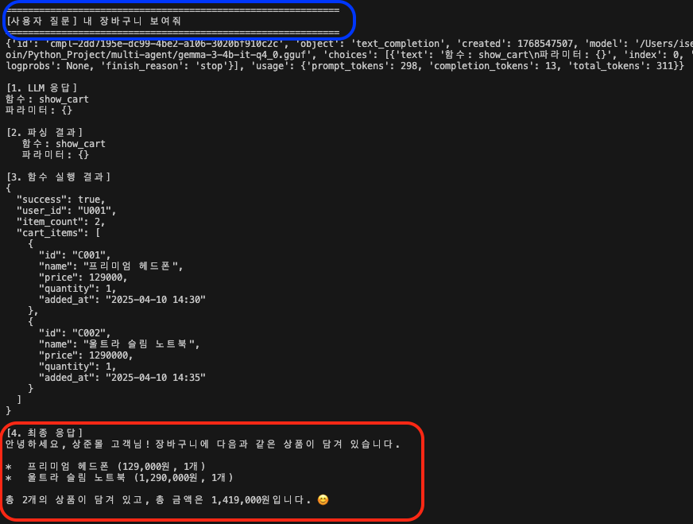
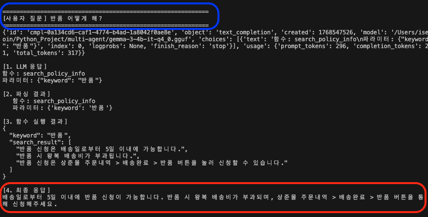
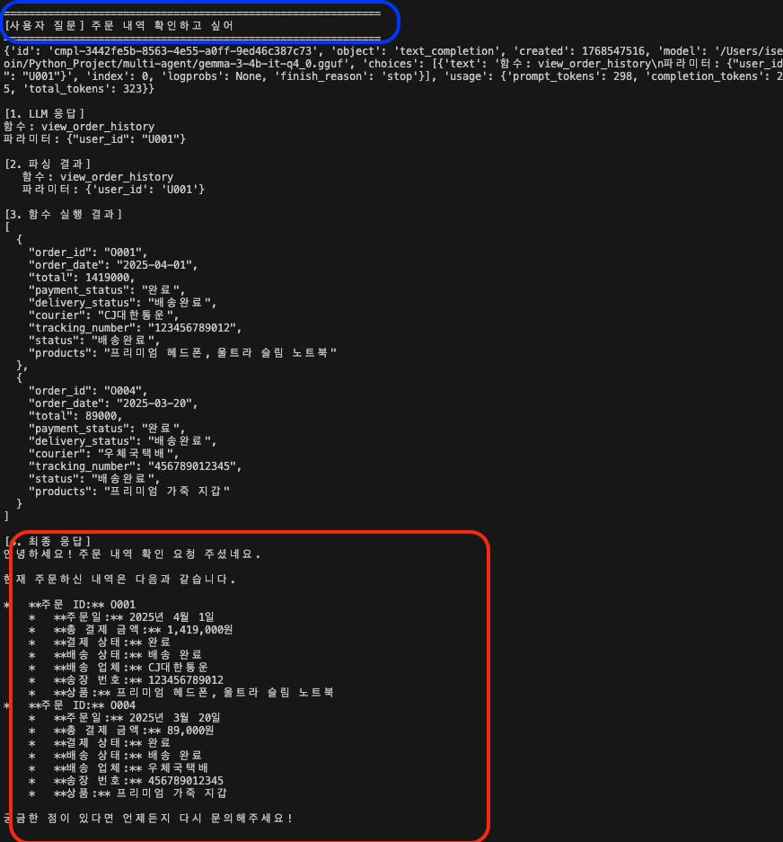
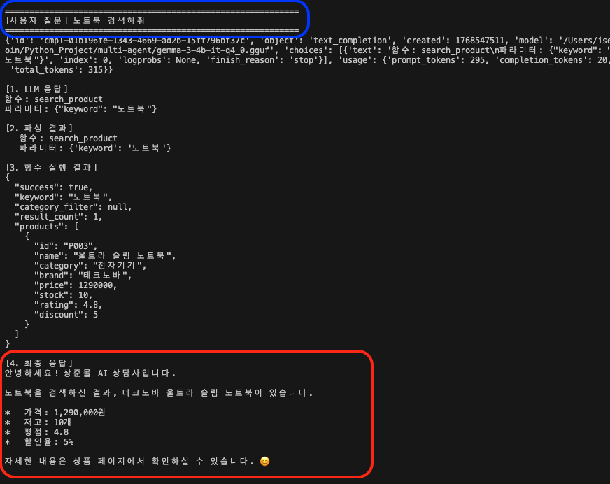

# 쇼핑몰 멀티 에이전트

## 프로젝트 개요
### 개요

해당 프로젝트는 쇼핑몰 멀티 에이전트 구현 코드입니다.<br>
참고한 링크: https://github.com/llm-fine-tuning/trl/blob/main/function_calling_single_gpu_fine_tuning_qwen/5.%20multi_turn_chatbot.ipynb<br>
위 사이트를 참조해서 만들었습니다. 해당 사이트에서는 리소스를 GPU/Qwen 모델을 사용하였습니다.<br>

**리소스 변경 사항**
* **GPU:** NVIDIA GPU → **Apple Silicon Metal (Macbook Pro M3)**
* *Model:** Qwen2.5-7B → **Gemma-3-4b-it_q4_0.gguf**


### 1. 프로젝트 구조(마지막 업데이트 일시: 2026-01-16 18:10)
```
.
├── .claude
│   └── settings.local.json
├── CLAUDE.md
├── create_dataset.py                                        # 데이터셋 및 데이터 구조화
├── gemma-3-4b-it_chatTamplate.json                          # gemma-3 챗 템플릿
├── gemma-3-4b-it_chatTamplate.txt                           # gemma-3 챗 템플릿(보기 더 편하게 텍스트 파일로 구성)
├── llama-cpp-responseTamplate.json                          # llama-cpp 엔진에서 response하는 구조
├── llama-cpp.txt                                            # test_function_execution.py 실행한 결과값
├── multiturn.py                                             # 멀티턴 예제 코드
├── README.md
├── schemas.py                                               # 대화 I/O(Req/Res) 구조
├── serving-gemma-3-4b-it-gguf.py                            # gguf 모델 서빙(api 서버) 코드
├── test_function_calling.py                                 # 총 3단계 중 1단계에 해당하는 코드
├── test_function_execution.py                               # 총 3단계 중 2,3단계에 해당하는 코드
├── test_prompt_diff.py                                      # 단순 프롬프트만 적을 때와 모델에서 요구하는 chatTamplate을 적용한거의 차이를 보기 위한 코드
├── tokenizer_config.py                                      # 모델이 텍스트를 이해할 수 있도록 쪼개는 방식(토크나이저)의 설정 파일
```

### 실행결과
파란 네모: 사용자 질문 / 빨간 네모: Gemma 답변

| 장바구니 | 반품 |
| :---: | :---: |
|  |  |
| 주문내역 | 물건 검색 |
| |  |
